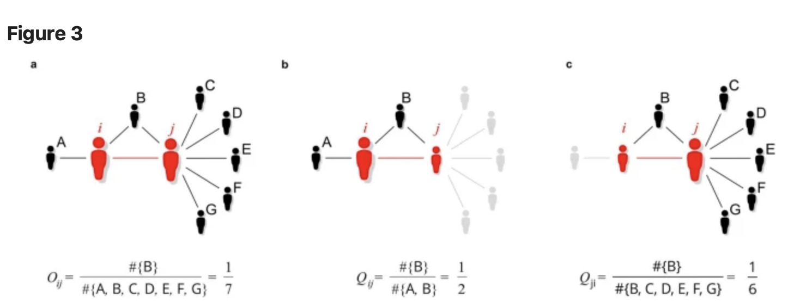
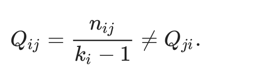
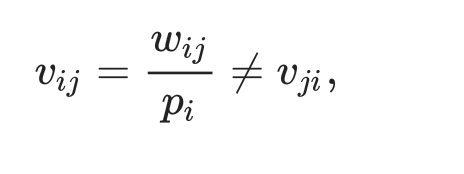

```{r setup, include=FALSE}
knitr::opts_chunk$set(echo = TRUE)
```

# Homework week 2

On this page The work we did in class is displayed first. After which I have described the data from one of the papers I will use for my project and in the final section there is a description of the variables I expect to need for my project.

------------------------------------------------------------------------

# in-class work

```{r}
set.seed(42)
snm <- matrix(sample(x= 0:1, size=100*100, replace = T), nrow = 100, ncol = 100)

diag(snm) <- 0

snm2 <- t(snm)

snm[upper.tri(snm)] <- snm2[upper.tri(snm2)]

snmsums <- rowSums (x=snm)
mean(snmsums)

#descriptives: mean nominations, stddev, outdegree, indegree
sum (snmsums)

density <- (sum(snmsums)/9900)
#density (total ties/possible ties)

density

rm(snmd)

snmd <- matrix(sample(x= 0:1, size=10000, replace = T), nrow = 100, ncol = 100)

diag(snmd) <- 0

snmd2 <- (t(snmd[upper.tri(snmd)])+snmd[lower.tri(snmd)])


set.seed(40)

snt <- matrix(sample(x= 0:1, size=4*4, replace = T), nrow = 4, ncol = 4)

diag(snt) <- 0

snt2 <- t(snt)


snt[upper.tri(snt)] <- snt2[upper.tri(snt2)]
snt[lower.tri(snt)]

# Print connections 1 (3 and 4)
# Test if 3 connects to 4
#
```

Making high density network in class

```{r}
install.packages("igraph")
library(igraph)

set.seed(123643)
snt <- matrix(sample(x= 0:1, size=16, replace = T), nrow = 4, ncol = 4)


snt_un <- snt + t(snt)
snt_un[snt_un == 2] <- 1
diag(snt_un) <-0
snt_un
netG <-graph_from_adjacency_matrix(snt_un)
class(netG)
plot(netG)
igraph::transitivity(netG, type="undirected")

?igraph
```

Visually print the social network

```{r}
set.seed(123643)
snt <- matrix(sample(x= 0:1, size=16, replace = T), nrow = 4, ncol = 4)

diag(snt) <-0

netG2 <-graph_from_adjacency_matrix(snt)
plot(netG2)
igraph::dyad_census(netG2)

```

------------------------------------------------------------------------

# Notes data and methods [@fronczak2022].

**First hypothesis**

This study employs similar methods to what I want to do. To test whether academics who have strong ties (many collaborations) also tend to have more network overlap, this study plotted tie strength against network overlap. However, due to established scientists with many ties cooperating with scientists with much fewer publications the measure of network overlap had to be amended to be unidirectional to account for this. (symmetrical measure is strongly biased towards the scientists with the most ties. this means that the more common scientists who in reality has a large relative network overlap with the established scientists appears to have a much weaker overlap which reverses the results.



Formula asymetric overlap (Nij=common nabours, Ki=degrees)

{width="162"}

Tie strength is also measured asymmetrically (Wij = tie strength in number of common publications, Pi = number of total publications)

{width="162"}

The rational behind this is that for scientists with many publication, each new tie carries less weight and reflects less strongly on importance of the collaboration for the scientists.

This measure I am a bit more skeptical of. While changing the weight of tie strength according to amount of publications, a linear relation seems problematic. For someone who has published 60 papers in total 20 of which are published with the same coauthor, would have a tie strength of: 20/60=0.33. At the same time a young scientists who has just published their first two papers with two different co-authors would have a tie strength of 0.5 with both of them.

Based on this example you would think the young scientists has stronger ties. Theoretically however, it seems hard to argue that his bond with both authors is stronger than the bond of the scientists who has published 20 papers with the same colleague.

**2nd hypothesis**

The second hypothesis is tested by plotting the average number of citations against the relative tie strength of scientists. The authors have also normalized this metric against total number of publications to account for established scientists getting more citations.

------------------------------------------------------------------------

# required data

I want to study how to what degree the measurement of tie strength has unfairly strengthened the relationship between overlap and tie strength in the paper by @fronczak2022. To do this I need three measures at the ego level:

average relative tie strength

average absolute tie strength

average asymmetrical overlap

Furthermore, I want to study whether the positive effect on citations of having on average weaker ties is stronger if these scientists are involved with more interdisciplinary work. For this I need

H index on ego level

Number of disciplines a scientists has published in.

------------------------------------------------------------------------

# references
