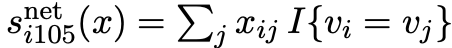

# Data & Methods

## Data

To answer the research questions, I created publication-networks based on published articles by Dutch sociologists and political scientists. These networks were produced using data obtained by J. Slabbekoorn. Names of the used scholars were scraped from the websites of the following universities: Radboud University, Erasumus university Rotterdam, University of Amsterdam, Leiden University, Vrije Universiteit, University of Utrecht, University of Tilburg and University of Groningen. To ensure the data contains most inter-university collaborations, data from all Dutch univerities was used. Publication data was obtained by webscraping openAlex, an online catalog storing publication data of all scholars. Publication network evolution will be studied by analysing the networks in three waves. wave one spans from 2015 through 2018, wave two spans from 2019 through 2023 and the final wave 3 spans from 2024 through 2025. All publications of the selected scholars during these waves form the basis of nomination networks. As our research questions are focused on first-author collaboration choices, I created a directed adjacency matrix where the first authors are ego's and their co-authors are the nominated alters. In the resulting matrix, a 1 represents a tie and depicts that the scholar in the row has been the first author in a collaboration with the scholar in the column.

Datacollection through webscraping does present some ethical concerns as the data is obtained without informed consent. While all used data is publicly available, wrangling the data for the purpose of this study enhances the data in ways which might compromise the respondents' privacy. In the present study, the gender and publication networks of the scholars will be obtained, however no substantive data around their research will be used. Therefore, our data only provides limited extra information about the scholars, alleviating ethical concerns. All of the data processing for this study is shown in this github repository for full transparancy.

## Dependent variable: collaboration network

The aim of the present study is to understand preferences for inter versus intra-university collaboration. This will be measured by adding the ego level covariate university affiliation to the network data. The dependent variable in the stochastic actor oriented model is the network structure in wave two and three including inter and intra-university ties. Before the RSiena analysis I will descriptively show the sums of all intra- and inter-univerity ties in the three waves and the sum of collaborations between all pairs of universities to get a feel for the data.

## independent variables

### intra-university preference

The main independent variable in this study is the preference of scholars to collaborate within universities rather than between universities. For this variable, the latest available affiliations to universities for all scholars have been used, some scholars are affiliated with both Dutch and foreign universities, for these scholars, the dutch universities are included in the data. While this might bias their apparrent publication networks to be look much more intra-university than they actually are, these scholars likely hold a more senior status which means they are less likely to be first-authors. They are important to include as their seniority also means that the likelihood of other scientists collaborating with them is likely. Scholars who are affiliated with multiple Dutch universities are removed because the effect which will be used cannot handle multiple values for one actor.

Preference for intra-university collaboration is captured by the RSiena sameX effect. In each ministep in the stochastic oriented model actors have a probability of making or breaking a tie based on whether it will improve their sameX value which is determined by the formula below. vi and vj represent ego-university and alter-university respectively, I is an indicator function which is 1 when vi and vj are the same and vi and vj are different. This is summed over all alters j of a given actor to produce the sameX score. A positive score on this variable in RSiena thus represents that a higher probability for scholars to collaborate within universities than between universities plays role in explaining the collaboration structures in following waves.

{width="179"}

### Gender

To test my interaction hypothesis I have used genderdata for all scholars generated by estimations based on first names. For 7 scholars without a full first name in the data, I have added the genders manually. In the RSiena models gender is included as the egoX(female) effect. This effect assumes that being female increases an actors tendency to make ties as opposed to being male. In the formula vi represents whether the actor is female and Xi+ represents their outdegree. Positive values mean that higher preference among female scholars compared to male scholars to collaborate with new people plays a role in explaining network structures in later waves. This variable will be interacted with intra-university preference to show whether a stronger preference to collaborate within universities among female compared to male scholars can explain future network structures.

{width="114"}

## Control variables 

To reliably make reliable inferences about actor behaviour based on the independent variables, all lower order effects also have to be included in the analysis. As the network structure in the first wave is likely already clustered by universities with many unclosed triads, effects measuring triadic closure will also result in higher percentages of intra-university collaborations. Similarly, als most ties in the first wave are likely within universities, reciprocity will also increase the relative amount of intra-university ties. In the strength of weak ties hypothesis, @granovetter1973 posited that triadic closure would be much more likely in networks with strong ties because open triads with strong ties produce emotional strain. By controlling for reciprocity and triadic closure, the preference for intra-university ties variable will only measure this preference for triadic closure within university networks therefore more closely resembling the theoretical mechanism. Furthermore

Furthermore, function level is included as a control variable. This is necesary as there are likely gender differences in function levels within universities and function levels play a large role in who forms ties as first author and who will receive ties. Therefore, function levels could confound gender effects in this study. For function level I will use the main covariate effects egoX, altX and sameX to measure respectively: activity related to the function level of the ego, activity related to the function level of the alter and homophily in function level. The altX and sameX effects will also be added as control variables for Gender.

To improve the goodness of fit I iterated with other effects that make theoretical sense to add as control variables. As a result I added three effects, firstly inPop to acount for nodes that already have a high indegree to receive even more incoming ties. Secondly outAct to account for the effect that the higher the outdegree someone has, the higher their likelihood to increase their outdegree. Lastly, isolateNet where positive values indicate that complete isolates have a higher chance of remaining isolates and non isolates are likely to become isolates.

## Analytical strategy

In order to answer my research questions and test my hypotheses, my analysis consists of two steps. I first show some descriptive analyses in all three waves to get a feel for the data and answer the first two research questions. I then use stochastic actor oriented modeling using the RSiena package [@RSiena] to answer the third and fourth research questions and test the corresponding hypotheses.

Hypotheses one is tested by calculating the sum of intra-university and inter-university ties in all three waves. Hypothesis two is tested by counting the sum of intra-university and inter-univerity ties split by the gender of the tie sender. To add context to these results, figures depicting the networks by university and gender are included. To get a better idea of the network characteristics I also show some network characteristics like diad census triad census and transitivity. Transitivity is particularly relevant as the preference for intra-university collaboration theoretically likely manifests itself in transitive closure within university networks. Furthermore, I show how much collaboration occurs between all pairs of universities to understand whether there are specific dyads of universities which show different patterns from the rest.

For hypotheses three and four, I estimate stochastic actor oriented models using RSiena. This software assumes actors make ministeps which consist of breaking a tie or creating a tie. The probability that any actor will make or break a tie is based on the network effects created in the model. To understand which effects are relevant in predicting later waves of a network, RSiena simulates networks with different probabilities awarded to each effect until it reaches a solution where the preferences of actors reflect the final network. to test hypotheses three and four, I estimate four RSiena models. Model 1 contains the default outdegree and reciprocity effects and the sameX(university) effect. Model 2 contains the sameX(university) effect, GWESPFf and the covariate effects egoX, altX and sameX for both funciton level and gender. Model 4 is used to test hypothesis 3 and includes sameX university and all control variables. in Model 4, the interaction between egoX(gender) and sameX(university) is added on top of all other effects. Model 4 will be used to test hypotheses 4. As a robustness check the Radboud University and University of Utrecht will be combined and used as a new university variable to test possible outsized influence of this pairing. For this robusntess check, model 1, 3 and 4 will be rerun with the new university variable. 

