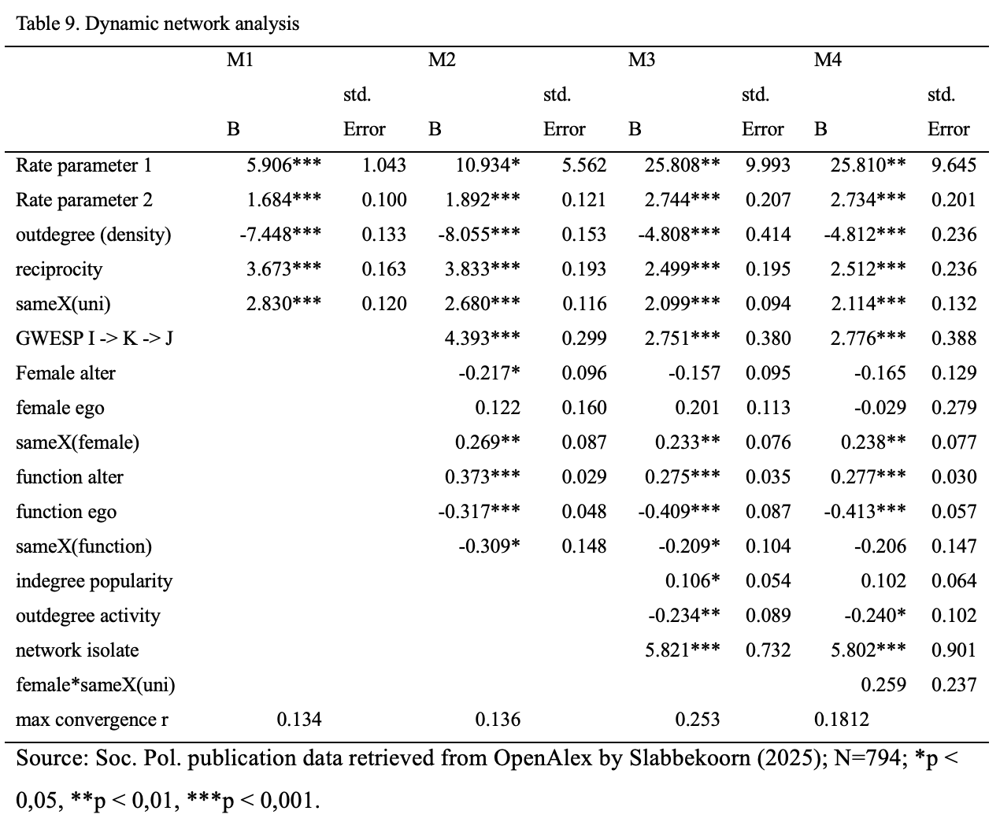

# Results RSiena

```{r, echo = FALSE}

rm(list = ls())

```

```{r, include = FALSE, message = FALSE}
fpackage.check = function(packages) {
    lapply(packages, FUN = function(x) {
        if (!require(x, character.only = TRUE)) {
            install.packages(x, dependencies = TRUE)
            library(x, character.only = TRUE)
        }
    })
}

fsave = function(x, file = NULL, location = "./data/processed/") {
    ifelse(!dir.exists("data"), dir.create("data"), FALSE)
    ifelse(!dir.exists("data/processed"), dir.create("data/processed"), FALSE)
    if (is.null(file))
        file = deparse(substitute(x))
    datename = substr(gsub("[:-]", "", Sys.time()), 1, 8)
    totalname = paste(location, datename, file, ".rda", sep = "")
    save(x, file = totalname)  #need to fix if file is reloaded as input name, not as x. 
}

fload = function(filename) {
    load(filename)
    get(ls()[ls() != "filename"])
}

fshowdf = function(x, ...) {
    knitr::kable(x, digits = 2, "html", ...) |>
        kableExtra::kable_styling(bootstrap_options = c("striped", "hover")) |>
        kableExtra::scroll_box(width = "100%", height = "300px")
}

packages = c(
    "RSiena", "tidyverse",
    'dplyr', 'stringr', "igraph", "ggplot2" 
)
fpackage.check(packages)

```

```{r, message = FALSE, echo = FALSE}


fcolnet = function(data = scholars, university = c("RU", "EUR", "UvA", "Leiden", "VU", "UU", "UvT", "RUG"), discipline = c("Sociologie", "Politicologie"), waves = list(c(2015,
    2018), c(2019, 2023), c(2024, 2025)), type = c("first")) {

    university = paste0('(', paste0(university, collapse='|' ), ')')
    discipline = paste0('(', paste0(discipline, collapse='|' ), ')')

    # step 1
    demographics = data$demographics
    sample = which(
        (str_detect(demographics$universiteit.22, university)
            | str_detect(demographics$universiteit.24, university)
            | str_detect(demographics$universiteit.25, university)
        ) & (
            str_detect(demographics$discipline.22, discipline)
            | str_detect(demographics$discipline.24, discipline)
            | str_detect(demographics$discipline.25, discipline)
        ) |> replace_na(FALSE))

    demographics_soc = demographics[sample, ] |> drop_na(id)

    # step 2
    ids = demographics_soc$id |> unique()


    scholars_sel = list() 
    for (id_ in ids){
        scholars_sel[[id_]] = bind_rows(scholars$works) |>
            filter(author_id == id_)
    }
    scholars_sel = bind_rows(scholars$works) 
    

    nwaves = length(waves)
    nets = array(0, dim = c(nwaves, length(ids), length(ids)), dimnames = list(wave = 1:nwaves, ids,
        ids))
    dimnames(nets)

    # step 3
    df_works = tibble(
            works_id = scholars_sel$id, 
            works_author = scholars_sel$authorships, 
            works_year = scholars_sel$publication_year
        )


    df_works = df_works[!duplicated(df_works), ]

    # step 4
    if (type == "first") {
        for (j in 1:length(waves)) {
            df_works_w = df_works[df_works$works_year >= waves[[j]][1] & df_works$works_year <= waves[[j]][2],
                ]
            for (i in 1:nrow(df_works_w)) {
                ego = df_works_w$works_author[i][[1]]$id[1]
                alters = df_works_w$works_author[i][[1]]$id[-1]
                if (sum(ids %in% ego) > 0 & sum(ids %in% alters) > 0) {
                  nets[j, which(ids %in% ego), which(ids %in% alters)] = 1
                }
            }
        }
    }

    if (type == "last") {
        for (j in 1:length(waves)) {
            df_works_w = df_works[df_works$works_year >= waves[[j]][1] & df_works$works_year <= waves[[j]][2],
                ]
            for (i in 1:nrow(df_works_w)) {
                ego = rev(df_works_w$works_author[i][[1]]$id[1])
                alters = rev(df_works_w$works_author[i][[1]]$id[-1])
                if (sum(ids %in% ego) > 0 & sum(ids %in% alters) > 0) {
                  nets[j, which(ids %in% ego), which(ids %in% alters)] = 1
                }
            }
        }
    }
    if (type == "all") {
        for (j in 1:length(waves)) {
            df_works_w = df_works[df_works$works_year >= waves[[j]][1] & df_works$works_year <= waves[[j]][2],
                ]
            for (i in 1:nrow(df_works_w)) {
                egos = df_works_w$works_author[i][[1]]$id
                if (sum(ids %in% egos) > 0) {
                  nets[j, which(ids %in% egos), which(ids %in% egos)] = 1
                }
            }
            diag(nets[j,,]) = 0
        }
    }

    output = list()
    output$data = demographics_soc
    output$nets = nets
    return(output)
}
```

```{r, message = FALSE}


scholars = fload('data/processed/20251017scholars.Rda')


```

```{r}
colnet = fcolnet(scholars, university = c("RU", "EUR", "UvA", "Leiden", "VU", "UU", "UvT", "RUG"))
df_ego = bind_rows(colnet$data)
```

```{r, message = FALSE}
df_ego = df_ego |>
    mutate(
        funcs = case_when(
            functie.22 == "PhD Candidate" ~ 1,
            functie.24 == "PhD Candidate" ~ 1,
            functie.25 == "PhD Candidate" ~ 1,
            functie.22 == "Postdoctoral Researcher" ~ 2,
            functie.24 == "Postdoctoral Researcher" ~ 2,
            functie.25 == "Postdoctoral Researcher" ~ 2,
            functie.22 == "Lecturer" ~ 3,
            functie.24 == "Lecturer" ~ 3,
            functie.25 == "Lecturer" ~ 3,
            functie.22 == "Researcher" ~ 3,
            functie.24 == "Researcher" ~ 3,
            functie.25 == "Researcher" ~ 3,
            functie.22 == "Assistant Professor" ~ 4,
            functie.24 == "Assistant Professor" ~ 4,
            functie.25 == "Assistant Professor" ~ 4,
            functie.22 == "Associate Professor" ~ 5,
            functie.24 == "Associate Professor" ~ 5,
            functie.25 == "Associate Professor" ~ 5,
            functie.22 == "Full Professor" ~ 6,
            functie.24 == "Full Professor" ~ 6,
            functie.25 == "Full Professor" ~ 6,
            .default = 0
        )
    )
table(df_ego$functie.25)

table(df_ego$funcs, useNA = "always")

table(df_ego$gender, useNA = "always")

# 7 NA's
# A.J.G.M. van Montfort (male)
# F. Goedkoop (female)
# L. Zijlstra (male)
# S. Liu (female)
# Sixtine van Outryve d'Ydewalle (female)
# T. Nowak (male)
# Z.E. Pardoel (female)

# Manually fix missings
df_ego = df_ego |>
    mutate(
        gender = case_when(
            naam == "A.J.G.M. van Montfort" ~ "male",
            naam == "L. Zijlstra" ~ "male",
            naam == "T. Nowak" ~ "male",
            naam == "F. Goedkoop" ~ "female",
            naam == "S. Liu" ~ "female",
            naam == "Sixtine van Outryve d'Ydewalle" ~ "female",
            naam == "Z.E. Pardoel" ~ "female",
            gender == "female" ~ "female",
            gender == "male" ~ "male",
        ))
  

#Numeric gender variable
df_ego = df_ego |>
    mutate(
        female = case_when(
            gender == "female" ~ 1,
            .default = 0
        )
    )

# Creating numeric university factor where latest known affiliation is used
df_ego$uni_22_num <- as.numeric(factor(
  df_ego$universiteit.22,
  levels = c("RU", "EUR", "UvA", "Leiden", "VU", "UU", "UvT", "RUG")
))

# numbers: 1=RU, 2=EUR, 3=WUR, 4=UvA, 5=Leiden, 6=VU, 7=UU, 8=UvT, 9=RUG.

df_ego$uni_24_num <- as.numeric(factor(
  df_ego$universiteit.24,
  levels = c("RU", "EUR", "UvA", "Leiden", "VU", "UU", "UvT", "RUG")
))

df_ego$uni_25_num <- as.numeric(factor(
  df_ego$universiteit.25,
  levels = c("RU", "EUR", "UvA", "Leiden", "VU", "UU", "UvT", "RUG")
))


df_ego$uni_22_24 <- ifelse (is.na(df_ego$uni_24_num), df_ego$uni_22_num, df_ego$uni_24_num)

df_ego$uni_num <- ifelse (is.na(df_ego$uni_25_num), df_ego$uni_22_24, df_ego$uni_25_num)


table(df_ego$uni_num, useNA = "always")

df_ego |>
  filter(is.na(uni_num)) |>
  select(naam, universiteit.22, universiteit.24, universiteit.25) |>
print()

# manually fix missing uni (Three remaining missings, affiliated with multiple dutch universities)
df_ego = df_ego |>
    mutate(
        uni_num = case_when(
            naam == "Amy Verdun" ~ 4,
            naam == "Catherine de Vries" ~ 3,
            naam == "Chaïm la Roi" ~ 8,
            naam == "Chlóe Tolmatcheff" ~ 8,
            naam == "Geert-Jan Knoops" ~ 3,
            naam == "Jonathan Mijs" ~ 2,
            naam == "Otto Holman" ~ 3,
            naam == "Sabine Mokry" ~ 4,
            naam == "Sawitri Saharso" ~ 5,
            naam == "Till Hovestadt" ~ 8,
            uni_num == 1 ~ 1,
            uni_num == 2 ~ 2,
            uni_num == 3 ~ 3,
            uni_num == 4 ~ 4,
            uni_num == 5 ~ 5,
            uni_num == 6 ~ 6,
            uni_num == 7 ~ 7,
            uni_num == 8 ~ 8,
        ))
#"Amy Verdun" Leiden (4)
#"Catherine de Vries" UvA (3)
#"Chaïm la Roi" RUG (8)
#"Chlóe Tolmatcheff" RUG (8)
#"Eric Cesne" UU/VU (NA)
#"Frank Takes" Leiden/UvA (NA)
#"Geert-Jan Knoops" UvA (3)
#"Jonathan Mijs" EUR (2)
#"Leonie Heres" VU/EUR (NA)
#"Otto Holman" UvA (3)
#"Sabine Mokry" Leiden (4)
#"Sawitri Saharso" VU (5)
#"Till Hovestadt" RUG (8)

df_ego = df_ego |>
  mutate(uni_name = factor(uni_num, levels = 1:8, labels = c("RU", "EUR", "UvA", "Leiden", "VU", "UU", "UvT", "RUG")))

# Making university variable for robustness check, RU and UU combined:

df_ego = df_ego |>
  mutate(uni_num_r = case_when(
     uni_num == 1 ~ 1,
     uni_num == 2 ~ 2,
     uni_num == 3 ~ 3,
     uni_num == 4 ~ 4,
     uni_num == 5 ~ 5,
     uni_num == 6 ~ 1,
     uni_num == 7 ~ 6,
     uni_num == 8 ~ 7,
        ))


# Save variables as constant Covariates for use in RSiena
funcs = coCovar(df_ego$funcs)

female = coCovar(df_ego$female)

uni = coCovar(df_ego$uni_num)

uni_r = coCovar(df_ego$uni_num_r)


```

```{r}
wave1 = colnet$nets[1,,]
wave2 = colnet$nets[2,,]
wave3 = colnet$nets[3,,]

nets = array(
    data = c(wave1, wave2, wave3),
    dim = c(dim(wave2), 2)
)

net = sienaDependent(nets)
```

```{r}
wave1 = colnet$nets[1,,]
wave2 = colnet$nets[2,,]
wave3 = colnet$nets[3,,]

nets = array(
    data = c(wave1, wave2, wave3),
    dim = c(dim(wave3), 3)
)

net = sienaDependent(nets)


mydata = sienaDataCreate(net, uni, female, funcs, uni_r)
print (mydata)

```

------------------------------------------------------------------------

# RSiena analysis

To test hypotheses three and four, four stochastic actor oriented models have been run using RSiena. The similarity in ties between network is low, the Jaccard index, meaning the proportion of ties that have remained unchanged is 1.48 between wave 1 and 2 and 1.193 between wave 2 and 3. This could pose a problem because my hypotheses are based on the premise that the network structure in later waves are dependent on the network structure of the first time point being wave 1 through behaviour of individual behaviours. @RSiena pose that network waves with very low Jaccard indeces might indicate subsequent waves are not evolutions of previous waves. They consider a Jaccard index above 0.3 as good, they expect networks with an Jaccard index below 0.2 to be difficult for estimation and below 0.1 to be unsuitable for RSiena. The worst Jaccard index for the current network is from waves 1 to 2 which is slightly less problematic because of a strong increase in degrees between these waves. Still, the low scores mean the results should be interpreted with some caution. To make sure all models will converge, where necessary, I will run intermediate models which allow the final models to start estimation with more likely starting parameters.

Table 9 shows the results of the main RSiena analysis. Model 1 shows a significant positive effect of sameX(uni) indicating a preference for intra-university collaboration over inter-university collaboration among scholars. Adding control variables in Model 2 and 3 slightly lowers the effect strength but it remains significant with a b of 2.099. This supports Hypothesis 3, meaning that sociologists and political scientists in the Netherlands are on average $e^{2.099}=8.16$ times more likely to collaborate within their universities than across different universities. Model 4 shows that as expected based on the descriptive analysis, there is no significant difference between men and women in the preference for intra-university collaboration which means our data does not support hypothesis 4.



```{r, eval = FALSE}
# Model 1
?print01Report
print01Report(mydata, modelname = "./results/soc_init")

myeff <- getEffects(mydata)

myeff = includeEffects(myeff, sameX)

myeff <- setEffect(myeff, sameX, interaction1 = "uni", include = T)

myAlgorithm = sienaAlgorithmCreate(
    projname = "soc_init")

ansM1 = siena07(
    myAlgorithm, 
    data = mydata, 
    effects = myeff,
    returnDeps = TRUE
)

fsave(ansM1, file = 'ansM1')
ansM1

```

```{r, eval = FALSE}
myeff <- getEffects(mydata)

myeff <- includeEffects(myeff, egoX, altX, sameX, gwespFF)

myeff <- setEffect(myeff, sameX, interaction1 = "uni", include = T)

myeff <- includeEffects(myeff, egoX, altX, sameX, interaction1 = "female")

myeff <- includeEffects(myeff, egoX, altX, sameX, interaction1 = "funcs" )


myAlgorithm = sienaAlgorithmCreate(
    projname = "soc_init")

ansM2 = siena07(
    myAlgorithm, 
    data = mydata, 
    effects = myeff,
    returnDeps = TRUE,
    prevAns = ansM1
)

fsave(ansM2, file = 'ansM2')

ansM2
```

```{r, eval = FALSE}

# Extra model to get model 3 to converge

myeff <- getEffects(mydata)

myeff <- includeEffects(myeff, egoX, altX, sameX, gwespFF)

myeff <- setEffect(myeff, sameX, interaction1 = "uni", include = T)

myeff <- includeEffects(myeff, egoX, altX, sameX, interaction1 = "female")

myeff <- includeEffects(myeff, egoX, altX, sameX, interaction1 = "funcs" )

# Adding additional effects to improve GOF by accounting more in and outdegree effects and accounting for isolates.
myeff <- includeEffects(myeff, isolateNet)

myAlgorithm = sienaAlgorithmCreate(
    projname = "soc_init")

ansM3_0 = siena07(
    myAlgorithm, 
    data = mydata, 
    effects = myeff,
    returnDeps = TRUE,
    prevAns = ansM2
)

fsave(ansM3_0, file = 'ansM3_0')

ansM3_0

```

```{r, eval = FALSE}
myeff <- getEffects(mydata)

myeff <- includeEffects(myeff, egoX, altX, sameX, gwespFF)

myeff <- setEffect(myeff, sameX, interaction1 = "uni", include = T)

myeff <- includeEffects(myeff, egoX, altX, sameX, interaction1 = "female")

myeff <- includeEffects(myeff, egoX, altX, sameX, interaction1 = "funcs" )

# Adding additional effects to improve GOF by accounting more in and outdegree effects and accounting for isolates.
myeff <- includeEffects(myeff, inPop, outAct, isolateNet)

myAlgorithm = sienaAlgorithmCreate(
    projname = "soc_init")

ansM3 = siena07(
    myAlgorithm, 
    data = mydata, 
    effects = myeff,
    returnDeps = TRUE,
    prevAns = ansM3_0
)

fsave(ansM3, file = 'ansM3')

ansM3


```

```{r, eval = FALSE}
myeff <- getEffects(mydata)

myeff <- includeEffects(myeff, gwespFF, egoX, altX, sameX)

myeff <- setEffect(myeff, sameX, interaction1 = "uni", include = T)

myeff = includeEffects(myeff, egoX, altX, sameX, interaction1 = "female")

myeff = includeEffects(myeff, egoX, altX, sameX, interaction1 = "funcs")

myeff <- includeInteraction(myeff, sameX, egoX, interaction1 = c("uni", "female"), include = T)


# Adding additional effects to improve GOF by accounting more in and outdegree effects and accounting for isolates.
myeff <- includeEffects(myeff, inPop, outAct, isolateNet)


myAlgorithm = sienaAlgorithmCreate(
    projname = "soc_init")


ansM4 = siena07(
    myAlgorithm, 
    data = mydata, 
    effects = myeff,
    returnDeps = TRUE,
    prevAns = ansM3_0,
)

fsave(ansM4, file = 'ansM4')

ansM4

```

## Robustness check

Table 10 shows Models 1, 3 and 4 with the Radboud University and University of Utrecht combined as this university pair shows much higher collaboration rates than all other university pairs. As could be expected when combining the universities with the most inter-university collaboration, the sameX(uni) parameter increased slightly in all models. However, there are no other substantial changes in relation to the main hypotheses.


```{r, eval = FALSE}
# Model 1 Robustness check

myeff <- getEffects(mydata)

myeff <- includeEffects(myeff, sameX)

myeff <- setEffect(myeff, sameX, interaction1 = "uni_r", include = T)

myAlgorithm = sienaAlgorithmCreate(
    projname = "soc_init")

ansM1_r1 = siena07(
    myAlgorithm, 
    data = mydata, 
    effects = myeff,
    returnDeps = TRUE
)

fsave(ansM1_r1, file = 'ansM1_r')

ansM1_r1

```

```{r, eval = FALSE}
#model 2 robustness check

myeff <- getEffects(mydata)

myeff <- includeEffects(myeff, egoX, altX, sameX, gwespFF)

myeff <- setEffect(myeff, sameX, interaction1 = "uni_r", include = T)

#myeff <- includeEffects(myeff, egoX, altX, sameX, interaction1 = "female")

#myeff <- includeEffects(myeff, egoX, altX, sameX, interaction1 = "funcs" )

myAlgorithm = sienaAlgorithmCreate(
    projname = "soc_init")

ansM2_r = siena07(
    myAlgorithm, 
    data = mydata, 
    effects = myeff,
    returnDeps = TRUE,
    prevAns = ansM1_r1
)

fsave(ansM2_r, file = 'ansM2_r')

ansM2_r


```

```{r, eval = FALSE}
#model 2 robustness check

myeff <- getEffects(mydata)

myeff <- includeEffects(myeff, egoX, altX, sameX, gwespFF)

myeff <- setEffect(myeff, sameX, interaction1 = "uni_r", include = T)

myeff <- includeEffects(myeff, egoX, altX, sameX, interaction1 = "female")

#myeff <- includeEffects(myeff, egoX, altX, sameX, interaction1 = "funcs" )

myAlgorithm = sienaAlgorithmCreate(
    projname = "soc_init")

ansM2_r1 = siena07(
    myAlgorithm, 
    data = mydata, 
    effects = myeff,
    returnDeps = TRUE,
    prevAns = ansM2_r
)

fsave(ansM2_r1, file = 'ansM2_r1')

ansM2_r1


```

```{r, eval = FALSE}
#model 3 robustness check

myeff <- getEffects(mydata)

myeff <- includeEffects(myeff, egoX, altX, sameX, gwespFF)

myeff <- setEffect(myeff, sameX, interaction1 = "uni_r", include = T)

myeff <- includeEffects(myeff, egoX, altX, sameX, interaction1 = "female")

myeff <- includeEffects(myeff, egoX, altX, sameX, interaction1 = "funcs" )

# Adding additional effects to improve GOF by accounting more in and outdegree effects and accounting for isolates.
myeff <- includeEffects(myeff, isolateNet)

myAlgorithm = sienaAlgorithmCreate(
    projname = "soc_init")

ansM3_r2 = siena07(
    myAlgorithm, 
    data = mydata, 
    effects = myeff,
    returnDeps = TRUE,
    prevAns = ansM2_r1
)

fsave(ansM3_r2, file = 'ansM3_r2')

ansM3_r2

#inPop, outAct, 

```

```{r, eval = FALSE}
#model 3 robustness check

myeff <- getEffects(mydata)

myeff <- includeEffects(myeff, egoX, altX, sameX, gwespFF)

myeff <- setEffect(myeff, sameX, interaction1 = "uni_r", include = T)

myeff <- includeEffects(myeff, egoX, altX, sameX, interaction1 = "female")

myeff <- includeEffects(myeff, egoX, altX, sameX, interaction1 = "funcs" )

# Adding additional effects to improve GOF by accounting more in and outdegree effects and accounting for isolates.
myeff <- includeEffects(myeff, inPop, outAct, isolateNet)

myAlgorithm = sienaAlgorithmCreate(
    projname = "soc_init")

ansM3_r = siena07(
    myAlgorithm, 
    data = mydata, 
    effects = myeff,
    returnDeps = TRUE,
    prevAns = ansM3_r2
)

fsave(ansM3_r, file = 'ansM3_r')

ansM3_r

 

```

```{r, eval = FALSE}
# Final model robustness

myeff <- getEffects(mydata)

myeff <- includeEffects(myeff, gwespFF, egoX, altX, sameX)

myeff <- setEffect(myeff, sameX, interaction1 = "uni_r", include = T)

myeff = includeEffects(myeff, egoX, altX, sameX, interaction1 = "female")

myeff = includeEffects(myeff, egoX, altX, sameX, interaction1 = "funcs")

myeff <- includeInteraction(myeff, sameX, egoX, interaction1 = c("uni_r", "female"), include = T)


# Adding additional effects to improve GOF by accounting more in and outdegree effects and accounting for isolates.
myeff <- includeEffects(myeff, inPop, outAct, isolateNet)


myAlgorithm = sienaAlgorithmCreate(
    projname = "soc_init")


ansM4r = siena07(
    myAlgorithm, 
    data = mydata, 
    effects = myeff,
    returnDeps = TRUE,
    prevAns = ansM3_r,
    nbrNodes = 4, 
    useCluster = TRUE
)

fsave(ansM4r, file = 'ansM4r')

ansM4r
```

------------------------------------------------------------------------

# Goodness of fit

To asses the goodness of fit, Models 2, 3 and 4 of the main analysis and Model 3R and 4R of the robustness check have been asessed in their ability to predict network evolution in indegree distribution, outdegree distribution, geodesic distribution and the number of possible triad configurations which are present. the goodness of fit of model 1 on all statistics has a p value of 0 which indicates a poor to very poor fit [@RSiena]. While model 3 is still very poorly fitted to predict indegree distribution, outdegree distribution and the distribution of triads are can be simulated by model 3 with a p value above 0.01. Geodesic distribution has a p-value of .194 meaning that the goodness of fit regarding this statistic is adequate. Model 4 has a slightly better fit on all statistics. For both model 3r and 4r the robustness check is shown to be a slighly worse predictive model for the used test statistics.

While adding extra control variables slightly improved the fit of the models, the goodness of fit remains quite poor as it fails the standard cutoff value p=0.05 on three of the four statistics. This means that the current model likely misses important parameters which would be needed for reliable interpretation of the data. However, as the Jaccard index is also quite low, it is very hard to get complex models to converge when adding more variables. (I get the principle of iterating to get better fitting models. However, the current models already take ours to converge per model so I decided to stop after seeing some improvement)

```{r}

#GeodesicDistribution not in base package, function script copied from RSiena documentation.

GeodesicDistribution <- function (i, data, sims, period, groupName,
  varName, levls=c(1:5,Inf), cumulative=TRUE, ...) {
  x <- networkExtraction(i, data, sims, period, groupName, varName)
  require(network)
  require(sna)
  a <- sna::geodist(symmetrize(x))$gdist
  if (cumulative)
  {
    gdi <- sapply(levls, function(i){ sum(a<=i) })
  }
  else
  {
    gdi <- sapply(levls, function(i){ sum(a==i) })
  }
  names(gdi) <- as.character(levls)
  gdi
}

# GOF model 2

GOFi_m2 <- sienaGOF(fload("data/processed/20251102ansM2.rda"), IndegreeDistribution, verbose = FALSE, join = TRUE, varName = "net")

GOFo_m2 <- sienaGOF(fload("data/processed/20251102ansM2.rda"), OutdegreeDistribution, verbose = FALSE, join = TRUE, levls = c(0:10, 15, 20),
    varName = "net")

GOFgd_m2 <- sienaGOF(fload("data/processed/20251102ansM2.rda"), GeodesicDistribution, verbose = FALSE, join = TRUE, varName = "net")

GOFtc_m2 <- sienaGOF(fload("data/processed/20251102ansM2.rda"), TriadCensus, verbose = FALSE, join = TRUE, varName = "net")

# GOF model 3                     
                                       
GOFi_m3 <- sienaGOF(fload("data/processed/20251102ansM3.rda"), IndegreeDistribution, verbose = FALSE, join = TRUE, varName = "net")

GOFo_m3 <- sienaGOF(fload("data/processed/20251102ansM3.rda"), OutdegreeDistribution, verbose = FALSE, join = TRUE, levls = c(0:10, 15, 20), varName = "net")

GOFgd_m3 <- sienaGOF(fload("data/processed/20251102ansM3.rda"), GeodesicDistribution, verbose = FALSE, join = TRUE, varName = "net")

GOFtc_m3 <- sienaGOF(fload("data/processed/20251102ansM3.rda"), TriadCensus, verbose = FALSE, join = TRUE, varName = "net")

# GOF model 4

GOFi_m4 <- sienaGOF(fload("data/processed/20251102ansM4.rda"), IndegreeDistribution, verbose = FALSE, join = TRUE, varName = "net")

GOFo_m4 <- sienaGOF(fload("data/processed/20251102ansM4.rda"), OutdegreeDistribution, verbose = FALSE, join = TRUE, levls = c(0:10, 15, 20), varName = "net")

GOFgd_m4 <- sienaGOF(fload("data/processed/20251102ansM4.rda"), GeodesicDistribution, verbose = FALSE, join = TRUE, varName = "net")

GOFtc_m4 <- sienaGOF(fload("data/processed/20251102ansM4.rda"), TriadCensus, verbose = FALSE, join = TRUE, varName = "net")


# GOF model 3r

GOFi_m3r <- sienaGOF(fload("data/processed/20251103ansM3_r.rda"), IndegreeDistribution, verbose = FALSE, join = TRUE, varName = "net")

GOFo_m3r <- sienaGOF(fload("data/processed/20251103ansM3_r.rda"), OutdegreeDistribution, verbose = FALSE, join = TRUE, levls = c(0:10, 15, 20), varName = "net")

GOFgd_m3r <- sienaGOF(fload("data/processed/20251103ansM3_r.rda"), GeodesicDistribution, verbose = FALSE, join = TRUE, varName = "net")

GOFtc_m3r <- sienaGOF(fload("data/processed/20251103ansM3_r.rda"), TriadCensus, verbose = FALSE, join = TRUE, varName = "net")

# GOF model 4r                           
                      
GOFi_m4r <- sienaGOF(fload("data/processed/20251103ansM4r.rda"), IndegreeDistribution, verbose = FALSE, join = TRUE, varName = "net")

GOFo_m4r <- sienaGOF(fload("data/processed/20251103ansM4r.rda"), OutdegreeDistribution, verbose = FALSE, join = TRUE, levls = c(0:10, 15, 20), varName = "net")

GOFgd_m4r <- sienaGOF(fload("data/processed/20251103ansM4r.rda"), GeodesicDistribution, verbose = FALSE, join = TRUE, varName = "net")

GOFtc_m4r <- sienaGOF(fload("data/processed/20251103ansM4r.rda"), TriadCensus, verbose = FALSE, join = TRUE, varName = "net")                       

```

### Goodness of fit model 2

```{r}
plot(GOFi_m2)
```

```{r}
plot(GOFo_m2)
```

```{r}
plot(GOFgd_m2)
```

```{r}
plot(GOFtc_m2)
```

### Goodness of fit model 3

```{r}
plot(GOFi_m3)
```

```{r}
plot(GOFo_m3)
```

```{r}
plot(GOFgd_m3)
```

```{r}
plot(GOFtc_m3)
```

### Goodness of fit model 4

```{r}

plot(GOFi_m4)

```

```{r}

plot(GOFo_m4)

```

```{r}

plot(GOFgd_m4)

```

```{r}

plot(GOFtc_m4)

```

### Goodness of fit model 3r

```{r}

plot(GOFi_m3r)

```

```{r}

plot(GOFo_m3r)

```

```{r}

plot(GOFgd_m3r)

```

```{r}

plot(GOFtc_m3r)

```

### Goodness of fit model 4r

```{r}

plot(GOFi_m4r)

```

```{r}

plot(GOFo_m4r)

```

```{r}

plot(GOFgd_m4r)

```

```{r}

plot(GOFtc_m4r)

```
